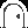
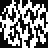
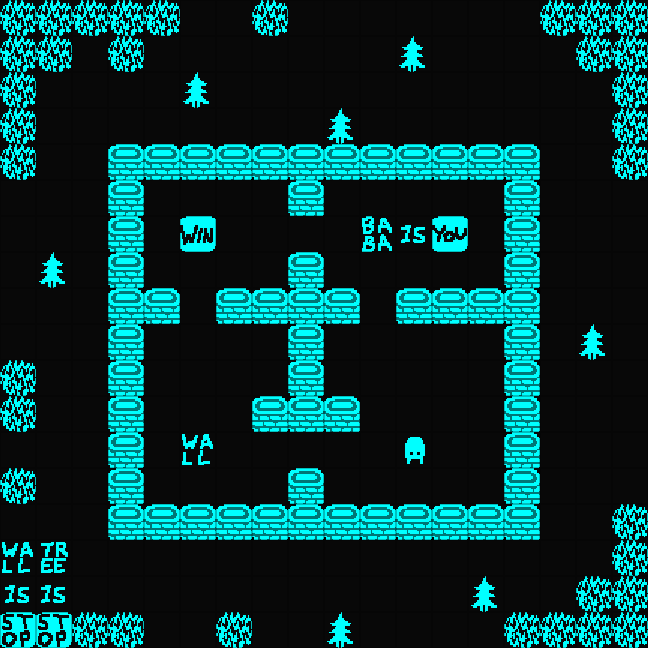
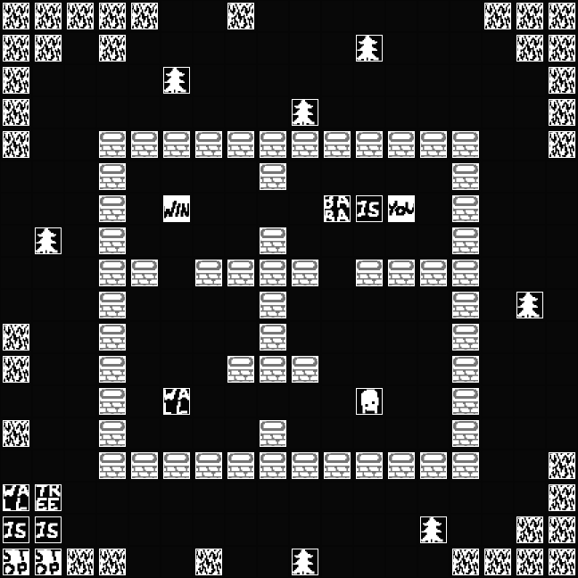
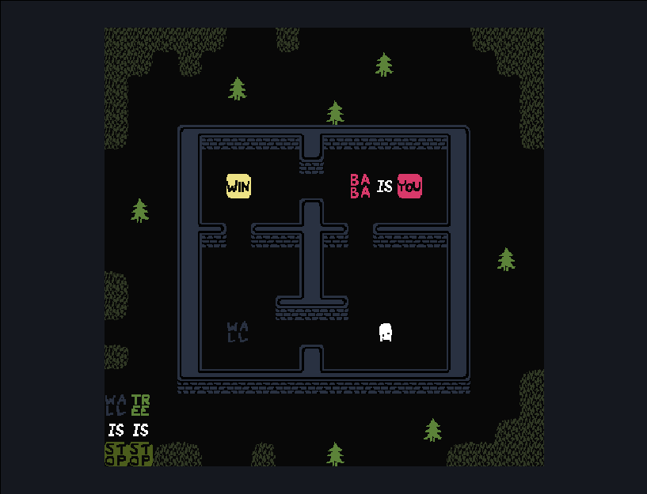

《Baba Is You》11月17日大型免费更新！！！

没想到还有更新，看到之后激动地把复刻捡起来填坑

[Steam 上的 Baba Is You](https://store.steampowered.com/app/736260/Baba_Is_You) 这游戏，我吹爆

# RpgMaker-is-you

clone of \<Baba Is You\> by RpgMaker  
在RPGMaker上复刻《Baba Is You》  

按自己的理解复刻了游戏《Baba Is You》。
按照最初的理解设计了简单的框架，但在实现过程中发现设计有些缺陷，于是一边重玩游戏一边完善设计，导致现在的代码有点乱，恳请多多包涵 XD。
在设计和编码的过程中，个人最大的感受就是：在充分考虑后再动手，一定可以设计出一个很巧妙的框架，而不是像我这样修修补补，结果埋下各种bug。

## 已实现的Baba对象类型

| type  | description |
| :---: | :---------- |
| Item  | 实物。 如 baba 为 baba(兔子?) ; key 为 钥匙 |
| Tile  | 图块实物。 如 wall 和 grass 其图像会根据四周同种物体的情况改变 |
| Role  | 角色实物。 |
| Floor | 地板实物。 如 tile 和 grass 为其设置更低的图层优先级 |
| Text  | 文字。 如 text_baba 为 文字baba ; text_is 为 文字is |
| Word  | 实物文字。 实物对应的文字 |
| Rule  | 规则文字。 作为规则的文字 |

## 已实现的Baba对象

| name     | Item | Tile | Role | Floor | Text | Word | Rule | description |
| :------: | :--: | :--: | :--: | :---: | :--: | :--: | :--: | :--: |
| baba     |  √   |      |  √   |       |  √   |  √   |      |  |
| key      |  √   |      |      |       |  √   |  √   |      |  |
| door     |  √   |      |      |       |  √   |  √   |      |  |
| flag     |  √   |      |      |       |  √   |  √   |      |  |
| rock     |  √   |      |      |       |  √   |  √   |      |  |
| tree     |  √   |      |      |       |  √   |  √   |      |  |
| tile     |  √   |      |      |  √    |  √   |  √   |      |  |
| keke     |  √   |      |  √   |       |  √   |  √   |      |  |
| wall     |  √   |  √   |      |       |  √   |  √   |      |  |
| grass    |  √   |  √   |      |  √    |  √   |  √   |      |  |
| you      |      |      |      |       |  √   |      |  √   |  |
| win      |      |      |      |       |  √   |      |  √   |  |
| stop     |      |      |      |       |  √   |      |  √   |  |
| push     |      |      |      |       |  √   |      |  √   |  |
| move     |      |      |      |       |  √   |      |  √   |  |
| is       |      |      |      |       |  √   |      |      |  |
| and      |      |      |      |       |  √   |      |      |  |
| not      |      |      |      |       |  √   |      |      |  |
| on       |      |      |      |       |  √   |      |      |  |
空 表示 ×

##  编辑baba关卡

#### 可以放置图块编辑关卡

#### 可以放置事件编辑关卡

#### 运行结果

#### 进入baba谜题
`◆脚本：$gameMap.baba_enableBabaMap();`

#### baba谜题的操作方法
+ up arrow : 上移动
+ down arrow : 下移动
+ left arrow : 左移动
+ right arrow : 右移动
+ z (ok) : 等待
+ x (cancel) : 回退 (暂不支持使用backspace)
+ page up : (暂时) 打开规则列表
+ page down : (暂时) 关闭规则列表

## 标签设置

| type  | description           | note     |
| :---  | :------------------   | :------- |
| Map   | 包含Baba谜题的地图     | `<baba is you:x, y, width, height>` |
| Map   | 显示gameover画面的事件 | `<BIY puzzle gameover start:事件id>` |
| Map   | 隐藏gameover画面的事件 | `<BIY puzzle gameover end:事件id>` |
| Event | 作为Baba对象的事件     | `<baba is you:name>` |

#### 包含Baba谜题的地图
> 地图备注  
> 设置地图为Baba地图，使其包含的Baba事件生效  
> 可以设置Baba地图边界，缺省时，默认为整个地图  

` <baba is you:x, y, width, height> `  
` <baba is you:0, 0, 17, 13> `  
+ baba is you
  - 标签名
  - 固定写法，区分大小写
  - 不能包含多余空格
+ [x, y, width, height]
  - 地图边界
  - 逗号分隔的四个整数
  - 分别为边界左上角坐标、边界宽高
  - 缺省时，地图边界默认为整个地图

#### 显示gameover画面的事件
> 触发gameover时执行的事件

` <BIY puzzle gameover start:事件id> `  
+ BIY puzzle gameover start
  - 标签名
  - 固定写法，区分大小写
  - 不能包含多余空格
+ 事件id
  - 所执行事件的事件id
  - 数值，正整数

#### 隐藏gameover画面的事件
> 解除gameover时执行的事件

` <BIY puzzle gameover start:事件id> `  
+ BIY puzzle gameover start
  - 标签名
  - 固定写法，区分大小写
  - 不能包含多余空格
+ 事件id
  - 所执行事件的事件id
  - 数值，正整数

#### 作为Baba对象的事件
> 事件备注  
> 设置事件为Baba对象，需要设置对象名  

` <baba is you:name> `  
` <baba is you:text_baba> `  
+ baba is you
  - 标签名
  - 固定写法，区分大小写
  - 不能包含多余空格
+ name
  - Baba对象名
  - 小写字母，或 text_ + 小写字母
  - 详见【其他说明】-【Baba对象】
  - 作为Item时，对象名为 name，如 baba
  - 作为Text时，对象名为 text_ + name，如 text_baba

## 后续任务

- [ ] 解决wall染色卡顿问题
- [ ] 破坏类规则 : weak, melt, hot, open, shut, defeat, sink 及特殊影响规则float
- [ ] ...

## 规则语法树
Comine soon

## 规则优先级
Comine soon

